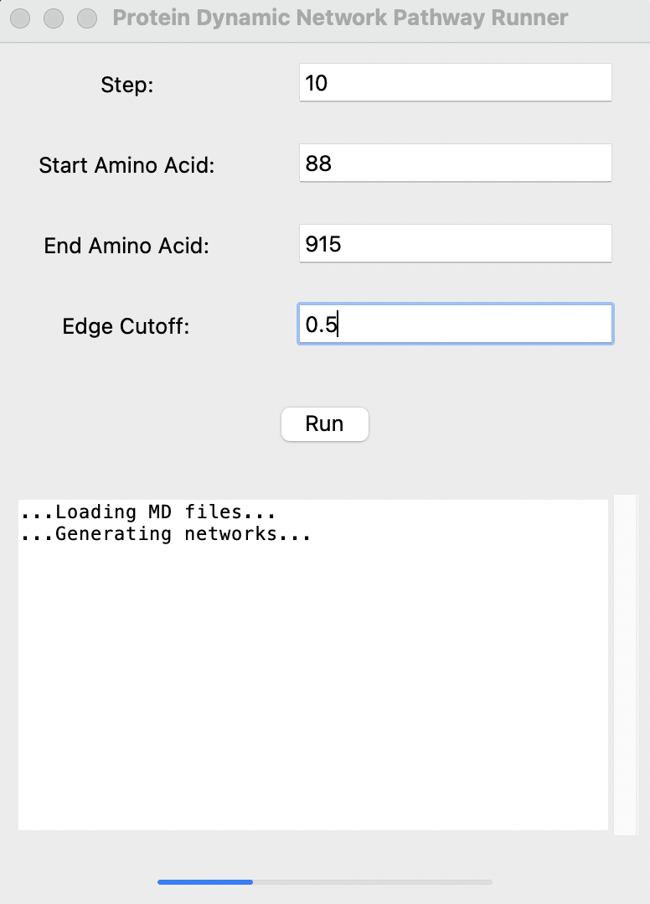
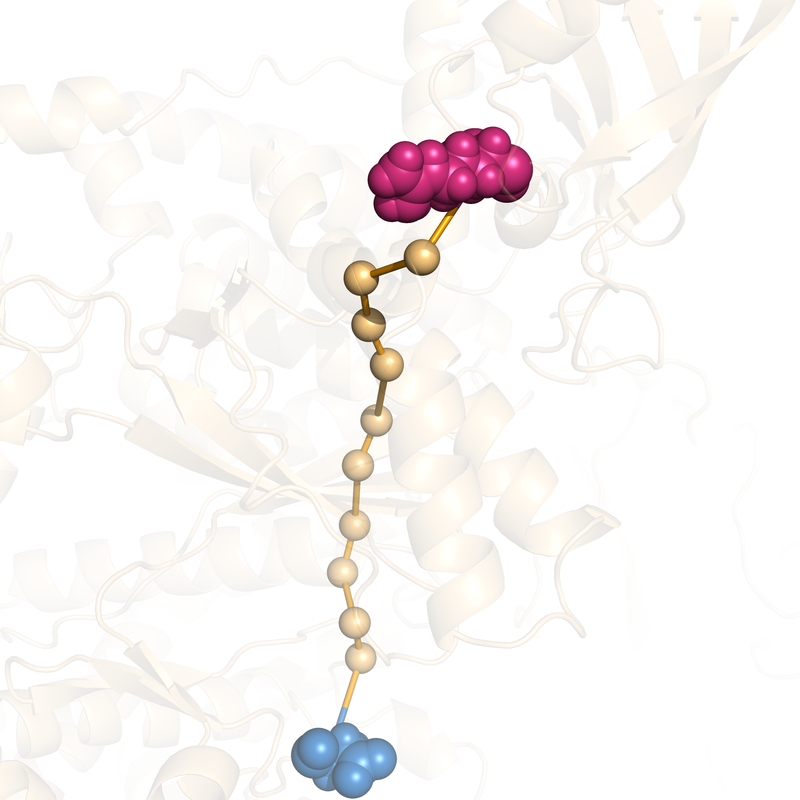

# Protein Dynamic Network Pathway Runner (PDNPR)

PDNPR 是一个用于可视化蛋白质动态网络路径的工具，结合了 PyMOL、NetworkX 和 MDTraj 等库，实现了从分子动力学轨迹提取、网络构建、路径分析和可视化。

## 代码获取
```sh
git clone https://github.com/Spencer-JRWang/PDNPR
```

## 环境配置

使用 Conda 创建并配置所需的环境。以下是 `environment.yml` 文件的内容：

```yaml
name: PDNPR
channels:
  - defaults
  - conda-forge
dependencies:
  - python=3.10
  - numpy
  - tkinter
  - networkx
  - mdtraj
  - matplotlib
  - pymol-open-source
```

## 环境配置
### 创建 Conda 环境：
```sh
conda env create -f environment.yml
```
### 激活conda环境
```sh
conda activate PDNPR
```
## 运行PDNPR
1. 确保已激活`PDNPR`环境，然后运行`pdnpr.py`脚本：
```sh
python pdnpr.py
```

2. 输入参数    
- 在 GUI 界面中，输入以下参数：
   - Step: 用于提取帧的步幅。
   - Start Amino Acid: 起始氨基酸编号。
   - End Amino Acid: 结束氨基酸编号。
   - Edge Cutoff: 边权重的阈值。
- 选择文件
   - 点击run按钮以选择分子动力学轨迹文件（XTC 文件）和蛋白质结构文件（PDB 文件）。

- 运行任务
   - 输出区域会显示进度和信息。任务包括以下步骤：
        - 提取帧
        - 生成网络
        - 合并网络
        - 计算最短路径
        - 生成并保存 PyMOL 图像
        - 查看结果
- 任务完成后，输出区域会显示最短路径的信息，保存图像和pse文件，并自动打开生成的图像文件。

## 运行示例
### GUI
<p align="center">
  
</p>
### Shortest route
```txt
shortest route: 915 -> 936 -> 935 -> 809 -> 808 -> 840 -> 841 -> 709 -> 708 -> 747 -> 743 -> 8
```
### PyMoL Figure
<p align="center">
  
</p>
